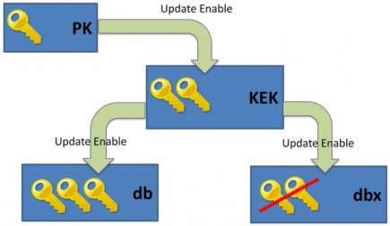

# SecureBoot signing script

**This is provided as is. I hold no responsibility over bricked UEFI. Read carefully.**

This script was created primarily to automate signing OpenCore binaries.

### SecureBoot 101



The UEFI specification defines four secure, non-volatile variables, which are used to control the secure boot system. They are: 

1. PK - Platform Key. Has *at most one* entry containing public key. Its private counterpart is used to sign updates to PK and KEK (not to db/dbx).  
If it's empty, system is in *setup mode*, turning off secure boot and allowing free update of any variable. Immediately after PK is written, system is in *user mode*, and variables must be signed.  
Essentially, this is system owner key.

2. KEK - Key Exchange Key. This contains one or several public keys. KEK private keys are used to sign 'db' and 'dbx' updates (and. rarely, binaries).  
Essentially these are administrator keys.

3. db - Signature Database. This is a whitelist, containing mixture of public keys, signatures and hashes of executables that are allowed to run.

4. dbx - Forbidden Signatures Database. Similarly to db, this is a blacklist. System with secure boot enabled would boot executables that check against db and do not check against dbx.

Usually PK contains hardware vendor key, KEK and db contain Microsoft keys and dbx contains some records like revoked keys. db keys are used to sign Windows bootloader, some other bootloaders (including Linux shim loader) and some hardware ROMs. For compatibility, these should be always included. KEK keys are used to update db and dbx; as that is arguably too much access, including them is left at user's discretion.

On a side note, you might've heard about Machine Owner Key. This is a separate security system based on shim loader - shim will load only binaries signed with one of MOKs in its database. Shim itself is still signed with Microsoft production key.

File formats used:

- .key - Private keys in X.509 format used to sign corresponding things. Keep them secure, obviously.
- .pem - Public key/certificate
- .cer - Binary (base64 encoded) certificate. .der is the same thing.
- .esl - A 'signature list' format used by UEFI to store keys. These are binary, but can be simply concatenated together.
- .auth - A 'signed signature list' format, UEFI requires keys to be in this format for importing.

### Further reading

- https://wiki.archlinux.org/title/Unified_Extensible_Firmware_Interface/Secure_Boot
- https://wiki.gentoo.org/wiki/User:Sakaki/Sakaki%27s_EFI_Install_Guide/Configuring_Secure_Boot
- https://habr.com/ru/articles/273497/ (Russian)
- https://forums.lenovo.com/t5/ThinkPad-T400-T500-and-newer-T-series-Laptops/Own-secure-boot-keys-on-T14/m-p/5069436?page=2
- https://github.com/perez987/OpenCore-and-UEFI-Secure-Boot

### What this script does

- Generate and cross-sign keys
- Download and include Microsoft db (and optionally KEK) keys 
- Download chosen OpenCore version and sign all necessary boot files
- Sign other .efi executable files

### Requirements

Packages needed: `openssl sbsigntool efitools unzip uuid-runtime curl wget acl`.  
Recommended OS for running it is Ubuntu 22.04, it has all required packages in repos.

A Dockerfile is provided for convenience. Run:
```sh
docker build -t sbsign .
docker run -it --rm -v "$(pwd):/app" -u $(id -u):$(id -g) sbsign
```

### Full mode

In this mode script will create full complement of new PK, KEK (new user key and optionally Microsoft keys) and db (user key and Microsoft 2011 and 2023 production keys).

It will also create removePK key, an empty file signed with PK - updating PK with it will clear it, entering setup mode without clearing other keys.

To install keys, put them (.auth files inside efikeys folder) onto FAT32 formatted USB drive and boot into UEFI. Find SecureBoot management options. 
Clear existing keys via Clear keystore/Delete keys/SecureBoot mode: Setup or whatever it is called in your case.

Then, enroll keys in **exactly this** order: db.auth > KEK.auth > PK.auth

There are other ways to install keys, either via booting KeyTool.efi or using `efi-updatevar` from efitools, depending on whether your motherboard supports that. Installing through UEFI interface is recommended.

Note: this will remove dbx record, which technically decreases security. But if you include Microsoft KEK keys, you will be able to install dbx updates via OS updates as usual.

### Minimal mode

Some devices (notably "corporate" Thinkpads with focus on security, T, X and P series) have parts (hardware ROMs and/or UEFI modules) that depend on additional vendor's keys in db and KEK. If you delete those keys (by replacing your PK/KEK/db), it will **brick** your UEFI. In case of laptops the only option then is replacing motherboard.  

To check if this is your case, look into KEK and db, either in UEFI or via `efi-readvar` program from efitools, and check if there are any non-Microsoft entries. E.g.
```
KEK: List 0, type X509
    Signature 0, size 957, owner 7facc7b6-127f-4e9c-9c5d-080f98994345
        Subject:
            C=JP, ST=Kanagawa, L=Yokohama, O=Lenovo Ltd., CN=Lenovo Ltd. KEK CA 2012
        Issuer:
            C=JP, ST=Kanagawa, L=Yokohama, O=Lenovo Ltd., CN=Lenovo Ltd. KEK CA 2012
```
If you have that, there are several options.

1. In case of Thinkpads, there is an option to enroll single record into db without signing it with KEK key. Choose minimal mode in script and generate image signing key, ISK.cer. Copy it onto FAT32-formatted flash drive. Then you would need to go into UEFI > Security > Secure Boot > Key management > DB, use Enroll Key and supply your key and UUID. Then you can boot executables signed with it.

2. It may be possible to enroll hashes of specific executables you want to run. It is simpler, no signing requires, but you would have to do that after any executable update.

3. There is an option to pull stock KEK, db (and dbx) records, add your keys and sign everything with your PK, see links above. This isn't implemented yet, and I don't have a spare Thinkpad to test that.

### Signing files

Script will download release build of OpenCore, latest version by default, and sign following files (X64 versions, of course, may gods help you if you deal with x32 SecureBoot):

- OC/OpenCore.efi
- OC/Drivers/OpenRuntime.efi
- OC/Drivers/OpenCanopy.efi
- OC/Drivers/OpenLinuxBoot.efi
- OC/Drivers/FirmwareSettingsEntry.efi
- OC/Drivers/ResetNvramEntry.efi
- OC/Drivers/ToggleSipEntry.efi
- OC/Drivers/AudioDxe.efi
- OC/Tools/OpenShell.efi
- BOOT/BOOTx64.efi
- **OC/Drivers/ext4_x64.efi**
- **OC/Drivers/btrfs_x64.efi**

Last two drivers are from [rEFInd v.0.14.2](https://sourceforge.net/projects/refind/files/0.14.2/) instead, stored in 'binaries' folder. I find them more stable than ones from OCBinaryData.

To sign any other .efi files, place them in 'user' folder, signed files will appear in 'signed/user'.

### TODO

- [x] Implement removePK key.
- [ ] Rewrite logic to better protect keys from accidental deletion
- [x] Improve security - set file permissions
- [ ] Improve security - store files somewhere else?
- [ ] Add an option to back up currently installed keys and reuse them
- [x] Add an option to choose RSA strength - by default 2048 for compatibility
- [ ] Add some information about using KeyTool and/or efitools for hardware without key management.
- [x] Provide Dockerfile
- [x] Set LICENSE

### License

This script is licensed under the terms of the GPL v3.  
Content of 'binaries' folder is provided for convenience and is licensed under its own license.  
Based on previous scripts by Roderick W. Smith, profzei, LUKAKEITON, perez987.  
Made with partial AI assistance (claude-4-sonnet).

